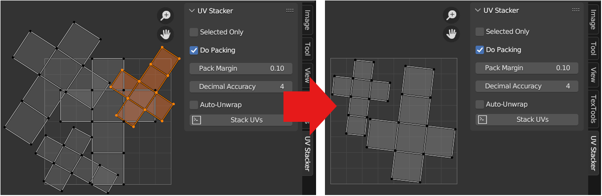

## Blender UV Stacker
Stacks similar UV on top of eachother to save space. Has options to automatically unwrap and pack islands

### Usage
In Edit mode, open the N panel in the Image Editor. Tweak settings and click "Stack UVs". UV islands with the same shape will be stacked on top of eachother. 
Note that islands with different sizes do not stack. Enabling "Auto-Unwrap" re-unwrap all meshes, which will also make the sizes match

### Requirements
Tested using Blender 3.6.2